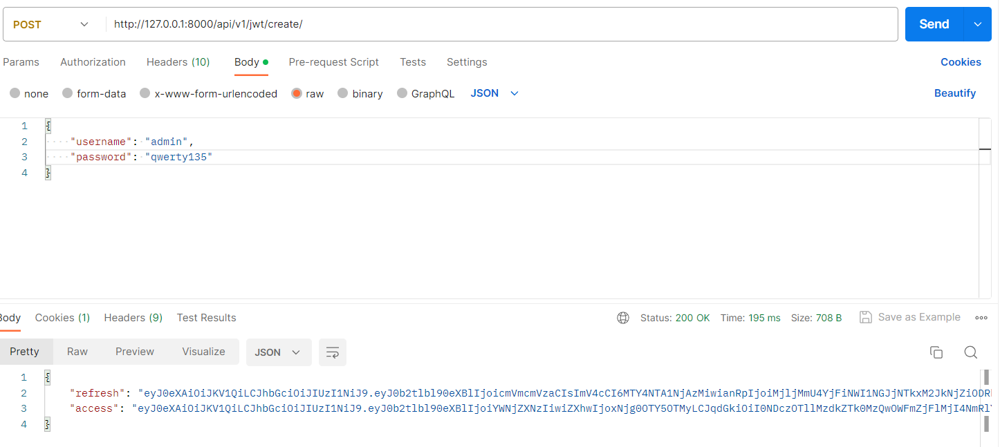

# api_final_yatube
# Описание


# Установка
1. Клонировать репозиторий и перейти в него в командной строке:
```
git clone <git@github.com:Ant0shich/api_final_yatube.git>
```
2. Cоздать и активировать виртуальное окружение:
```
python -m venv venv
```

```
source venv/bin/activate
```
3. Установить зависимости из файла requirements.txt:
```
python -m pip install --upgrade pip
```

```
pip install -r requirements.txt
```
4. Выполнить миграции:
```
python manage.py migrate
```
5. Запустить проект:
```
python manage.py runserver
```

# Примеры
1. Получение JWT-токена
```
http://127.0.0.1:8000/api/v1/jwt/create/
```


