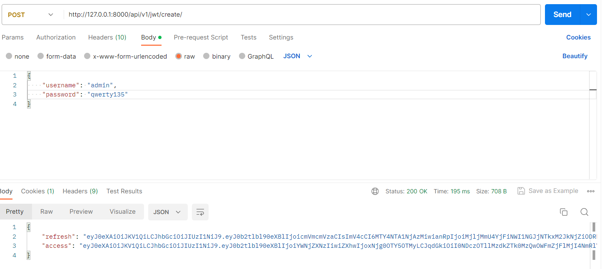
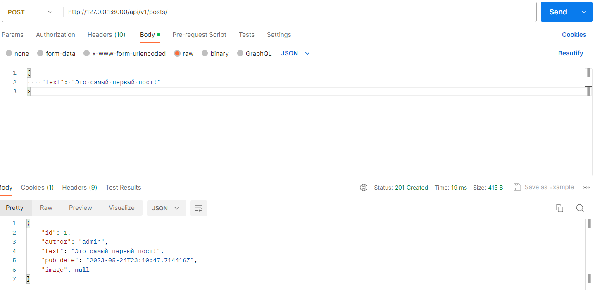
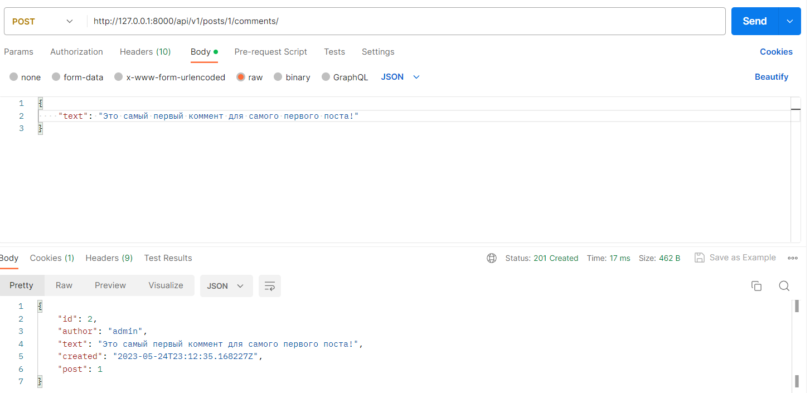

# api_yatube
# Описание
Это DRF-проект. Здесь можно создать аккаунт, получив JWT-токен. После авторизации каждый пользователь имеет право на создание/изменение/удаление своего поста, добавление/изменение/удаление комментариев к другим постам пользователей, а также есть возможность подписаться на любимых или не очень любимых авторов. Устанавливай и пробуй!


## Стек технологий:
* [Python 3.7](https://www.python.org/downloads/)
* [Django 2.2.16](https://www.djangoproject.com/download/)
* [Django Rest Framework 3.12.4](https://pypi.org/project/djangorestframework/#files)
* [Pytest 6.2.4](https://pypi.org/project/pytest/)
* [Simple-JWT 1.7.2](https://pypi.org/project/djangorestframework-simplejwt/)


# Установка
1. Клонировать репозиторий и перейти в него в командной строке:
```
git clone git@github.com:Ant0shich/api_final_yatube.git
```
2. Cоздать и активировать виртуальное окружение:
```
python -m venv venv
```

```
source venv/bin/activate
```
3. Установить зависимости из файла requirements.txt:
```
python -m pip install --upgrade pip
```

```
pip install -r requirements.txt
```
4. Выполнить миграции:
```
python manage.py migrate
```
5. Запустить проект:
```
python manage.py runserver
```

# Примеры
1. Получение JWT-токена (POST)
```
http://127.0.0.1:8000/api/v1/jwt/create/
```


2. Создание публикации (POST)
```
http://127.0.0.1:8000/api/v1/posts/
```


3. Получение публикаций (GET)
```
http://127.0.0.1:8000/api/v1/posts/
```


4. Добавление комментария (POST)
```
http://127.0.0.1:8000/api/v1/posts/{post_id}/comments/
```



## Документация для Yatube API доступна по адресу:
```http://127.0.0.1/redoc/```